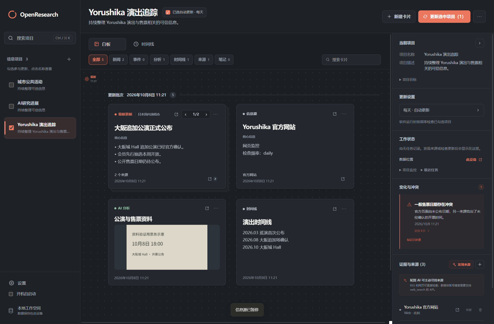
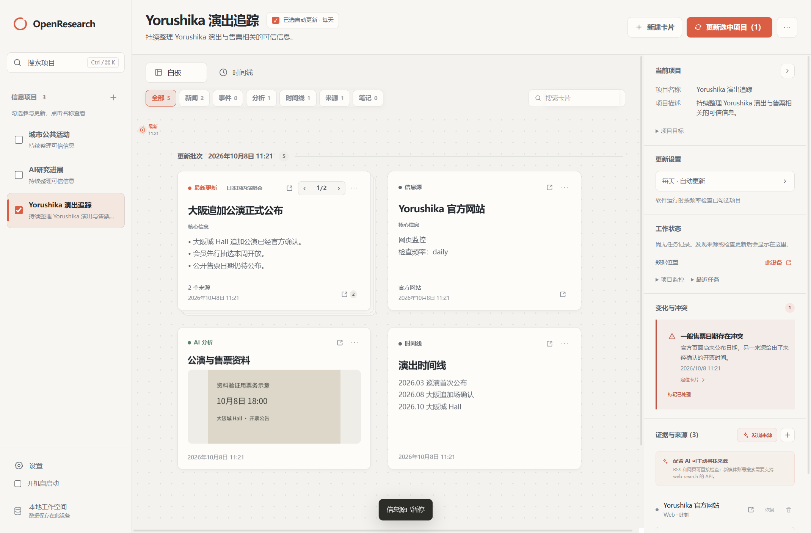
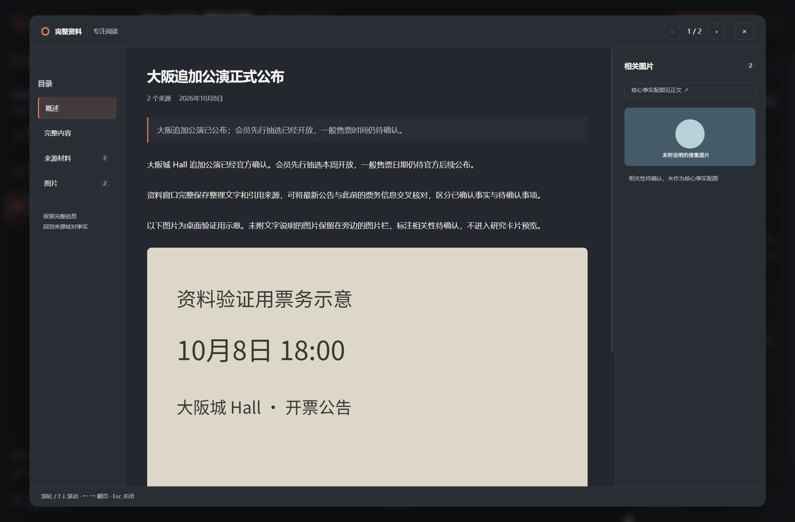

# OpenResearch 1.6.0

## 简体中文

按已确认的视觉方案重新设计研究工作台和完整资料窗口。

- **统一双主题**：石墨灰深色、暖白浅色与珊瑚橙强调色，跟随系统切换。统一卡片、表单、工具栏、侧栏和阅读器的表面与文字层级。
- **项目导航与操作**：圆环品牌、可搜索项目列表、独立更新勾选、简洁项目简介。项目标题旁显示真实自动更新状态及频率，点击可打开项目设置。侧栏新增紧凑自启动开关，与设置页同步。
- **研究白板**：视图切换与分类筛选分两层，显示实际分类数量；保留搜索、时间线、更新批次、拖拽、缩放及卡包操作。沿用已保存坐标，小窗口通过画布滚动查看，避免升级时重新排列用户资料。
- **上下文右栏**：项目信息、更新频率、真实最新任务状态、变化与来源分区；监控和历史可折叠。来源可直接打开，数据目录按钮保持可见。监控“运行中”与更新任务“完成/失败”分开呈现。
- **完整资料窗口**：目录、正文、图片三栏。概述与完整文字分开展示，核心配图在正文中，其他已保存图片和相关性待确认标记在图库中。目录定位、直接跳到核心图片、图库及正文独立滚轮/方向键滚动、卡包翻页、焦点恢复均保留。

验证：264项自动测试、代码检查、类型检查与完整构建通过。真实 Electron 验证覆盖深浅色、1080×680最小窗口、完整材料与图片、中文输入草稿、键盘翻页、卡包滚轮隔离和大卡片文字空间。

截图使用隔离示例数据和明确标注的验证图片，不代表真实公告或研究结论。界面不会替材料增加未经确认的可信度标签。升级不迁移或删除已有项目与卡片数据。安装包未签名或 Apple 公证；Mac 安装及系统交互未实机验证。

## English

The approved visual concept is now implemented in the research workspace and full-material reader.

- **System themes:** neutral graphite, warm white, and coral accents, with consistent surfaces and text across cards, forms, toolbars, navigation, and the reader.
- **Project navigation:** ring branding, searchable project descriptions, independent update selection, real automation state and frequency, and a compact sidebar launch-at-login switch synchronized with Settings.
- **Research board:** separate view and filter rows with actual category counts. Search, timeline, batches, dragging, resizing, and packs remain functional. Saved coordinates are preserved; narrow windows scroll the canvas rather than rearranging user material.
- **Inspector:** clear project, frequency, latest task, change, and source sections; collapsible monitoring/history. Source links open directly and the data-folder action stays visible. Monitoring state is distinguished from actual update success/failure.
- **Reader:** contents, complete article, and gallery columns. Core images appear in the article; remaining images retain their descriptions and uncertainty labels. Contents navigation, direct core-image jump, independent article/gallery scrolling, keyboard pagination, and focus restoration are preserved.

Validation: all 264 automated tests, lint, type checks, and builds passed. Native Electron checks cover light/dark themes, the minimum 1080×680 window, complete material/images, Chinese input drafts, keyboard pages, pack-only wheel input, and large-card text layout.

Screenshots contain isolated demonstration data and explicitly labeled verification images, not real research conclusions. The UI does not invent evidence-confidence labels. Existing projects and card data remain intact. Installers are unsigned/not notarized; physical macOS installation and interaction were not tested.
